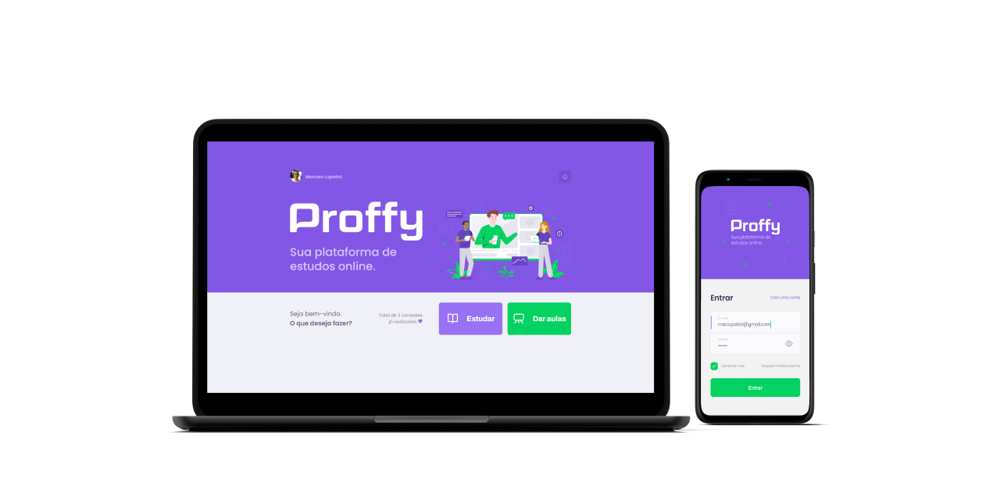
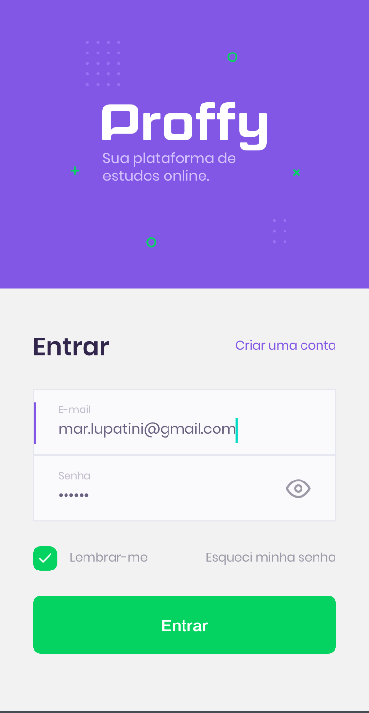
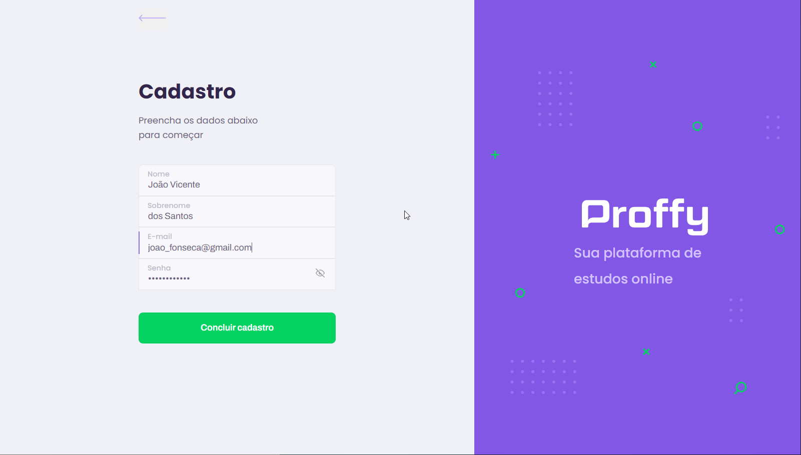
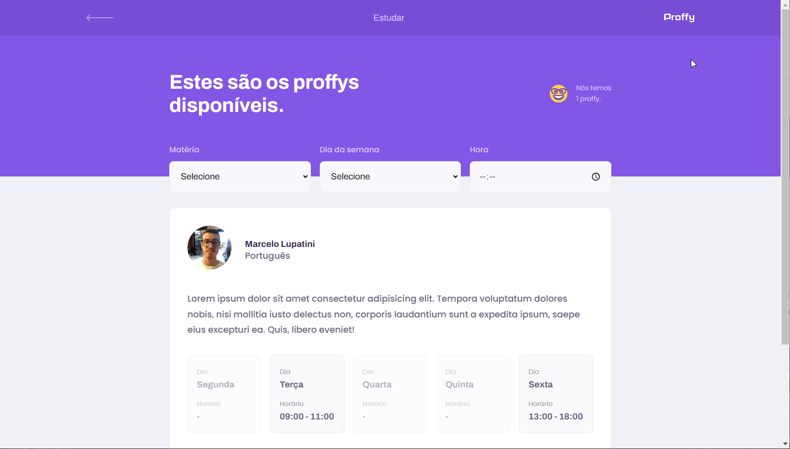
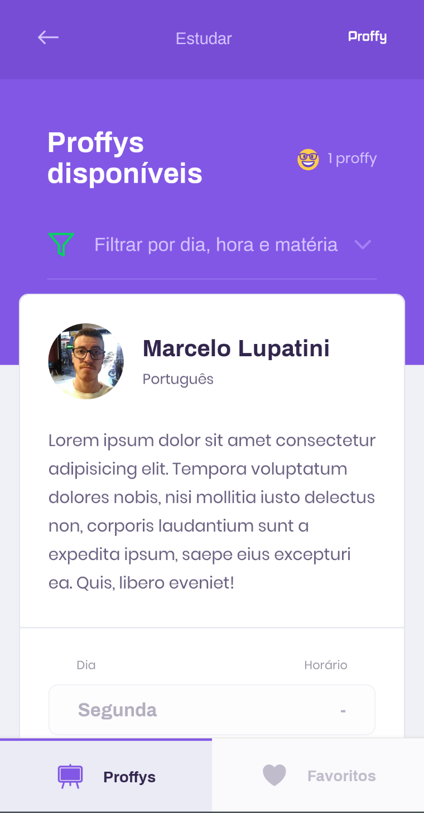
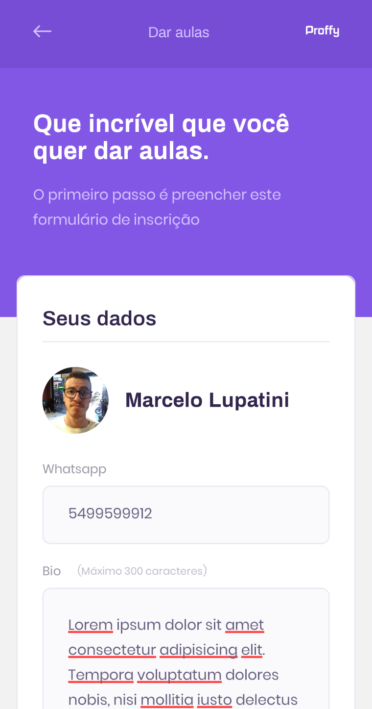
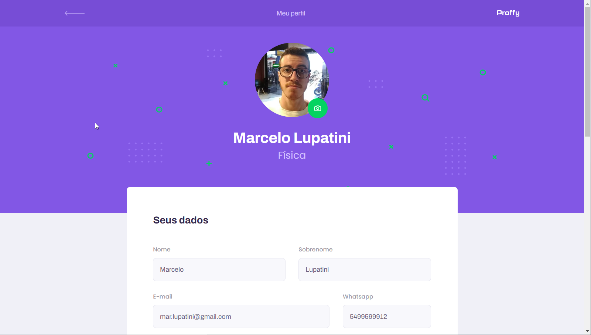

<h1 align="center">
  
</h1>
<!-- <p align="center">:green_book: Plataforma de estudos online conectando alunos e professores </p> -->

<h4 align="center"> 
	Next Level Week Proffy v2 🚀
</h4>

<div align="center">
  
  
  
  
  
  
</div>

## Índice

* [Índice](#índice)
* [Sobre](#sobre)
  * [Conceito do projeto](#conceito-do-projeto)
  * [Tecnologias](#principais-tecnologias-utilizadas)
  * [Comparação entre versões](#comparação-entre-versões-1-e-2-da-plataforma)
* [Como rodar na sua máquina?](#como-rodar-na-sua-máquina)
  * [Back-End](#back-end)
  * [Front-End Web](#front-end-web)
  * [Front-End Mobile](#front-end-mobile)
* [Licença](#licença)

## Sobre

A primeira versão do projeto foi desenvolvida durante a segunda edição do evento Next Level Week propiciado pela empresa [Rocketseat](https://rocketseat.com.br/). Baseou-se em um layout elaborado no Figma.

Por sua vez, a segunda versão baseou-se em um novo layout do Figma para [Web](https://www.figma.com/file/Agvethfp7FANyXDDU3LUfd/Proffy-Web-2.0) e [Mobile](https://www.figma.com/file/nZ7lMEBYZSMhRxfdvy6fKz/Proffy-Mobile-2.0) e em um [documento](https://www.notion.so/Vers-o-2-0-Proffy-eefca1b981694cd0a895613bc6235970) para descrever as novas funcionalidades. Um sumário das diferenças entre as versões pode ser conferido [abaixo](#comparação-entre-versões-1-e-2-da-plataforma).

O sistema, desenvolvido em TypeScript, é composto de um servidor HTTP Node, um [site](https://proffy.marcel099.vercel.app/) em React e um aplicativo móvel em React Native.

A opção por essas ferramentas foi realizada pela Rocketseat por acreditarem formar um conjunto de tecnologias poderoso ao permitir desenvolver desde o Back-End até o aplicativo móvel em uma só linguagem: o JavaScript. A escolha por TypeScript, um superset do JavaScript, foi realizada por acreditar trazer um aumento de confiabilidade de código.

### Conceito do projeto

O sistema Proffy é uma plataforma de estudos online com a finalidade de conectar alunos e professores. Para fazer uso da plataforma, primeiro é preciso se cadastrar e, em seguida, realizar login.

<div
  align="center"
  style="
    display: flex;
    gap: 1rem;
    justify-content: center;
    margin-bottom: 1rem;
  "
>
  
  
</div>

Após entrar, alunos podem consultar uma lista de professores professores cadastrados e entrar em contato com um professor através do WhatsApp. No aplicativo, o aluno também pode favoritar professores para encontrá-los mais rapidamente quando desejado.
<div
  align="center"
  style="
    display: flex;
    gap: 1rem;
    justify-content: center;
    margin-bottom: 1rem;
  "
>
  
  
</div>

Por sua vez, professores podem personalizar seu perfil com informações referentes à disciplina que leciona, sua biografia, seus horários disponíveiees para aula e seu custo de hora por aula.

<div
  align="center"
  style="
    display: flex;
    gap: 1rem;
    justify-content: center;
    margin-bottom: 1rem;
  "
>
  
  
</div>

### Principais tecnologias utilizadas

A plataforma foi desenvolvida em TypeScript. É composta de 3 partes:

- Back-End
  - [Node.js](https://nodejs.org/en/)
  - [Express](https://expressjs.com/)
  - [Knex](https://knexjs.org/)
  - [PostgreSQL](https://www.postgresql.org/)
- Front-End Web
  - [Vite](https://vitejs.dev/)
  - [React](https://react.dev/)
  - [React Router](https://reactrouter.com/)
- Front-End Mobile
  - [React Native](https://reactnative.dev/)
  - [React Navigation](https://reactnavigation.org/) - [Stack](https://reactnavigation.org/docs/stack-navigator/) e [Bottom Tabs](https://reactnavigation.org/docs/bottom-tab-navigator)
  - [Async Storage](https://reactnative.dev/docs/asyncstorage)

Alguns pontos a destacar:

- Cada aplicação possui [ESLint](https://eslint.org/) configurado para padronização de código
- A hospedagem de imagens de avatar de usuário é realizada na [AWS S3](https://aws.amazon.com/pt/s3/)
- A autenticação do usuário baseia-se em [JWT](https://jwt.io/)
- O envio de e-mail de recuperação de senha usa [Nodemailer](https://nodemailer.com/) e Gmail

Se desejar explorar as rotas do servidor HTTP Node desenvolvido para essa plataforma, poderá fazer isso através do [Insomnia](https://insomnia.rest/):

[](https://insomnia.rest/run/?label=NLW%20%2302%20-%20Proffy&uri=https%3A%2F%2Fgithub.com%2Fmarcel099%2Frs-nlw-02-proffy%2Fblob%2Fmaster%2Fassets%2Finsomnia_collection.json)


### Comparação entre versões 1 e 2 da plataforma

Durante o evento Next Level Week, a aplicação foi desenvolvida com estas funcionalidades:

- Cadastro de uma aula, a qual contém informações da matéria e do professor que a leciona
- Listagem de aulas com filtros
- No aplicativo, salvar professores favoritos para facilidade de acesso
- Contato com professores via WhatsApp

A versão 2 da plataforma foi lançada como um desafio aos alunos que finalizaram o evento ao disponibilizar um novo layout do Figma que adiciona mais funcionalidades à plataforma, as quais foram:

- Cadastro de usuários professores e alunos
- Fluxo de redefinição de senha com envio de e-mail
- Login e logout na plataforma
- Personalização do perfil do usuário como professor, agora com possibilidade de cadastro de horários de aula
- Listagem de aulas passou a ser de usuários professores, além de trazer paginação da lista e com cada professor da lista apresentando informações de horários disponíveis

## Como rodar na sua máquina?

Antes de tudo, vale lembrar que se você quiser apenas acessar a plataforma para experimentá-la, você pode fazer isso através deste <a href="https://proffy.marcel099.vercel.app/">link</a>.

Se deseja executar o projeto na sua máquina, você precisa, antes de tudo, instalar as seguintes ferramentas: [Git](https://git-scm.com), [Node.js](https://nodejs.org/en/), [Yarn](https://yarnpkg.com/) (opcional). Caso queira alterar algum arquivo sugiro também que instale algum editor de texto, como o [Visual Studio Code](https://code.visualstudio.com/) e o [Sublime](https://www.sublimetext.com/3).

Após isso, clone o repositório na pasta de sua escolha utilizando o seguinte comando na linha de comando:

```bash
git clone https://github.com/marcel099/rs-nlw-02-proffy
```

### Back-End

É necessário manter o servidor em execução através destes comandos para o correto funcionamento da plataforma. Para isso, comece instalando as dependências:

```bash
# Acesse a pasta do back-end a partir da pasta do repositório
$ cd server

# Instale as dependências de funcionamento
$ npm install
```

Em seguida, crie um banco de dados <a href="https://www.postgresql.org/">PostgreSQL</a> antes de executar a aplicação. Aconselho que crie o banco de dados <a href="https://hub.docker.com/_/postgres">Postgre</a> utilizando o software <a href="https://www.docker.com/">Docker</a>, pois foi a forma utilizada na versão 2.0 do projeto.

Com o banco de dados pronto, preencha as informações de variáveis de ambiente presentes no arquivo <a href="https://github.com/marcel099/nlw-2-proffy/blob/feature/setup-deploy/server/.env.example">`.env.example`</a>, o que inclui as credenciais de conexão ao banco Postgres que você configurou.

Por fim, rode o seguinte comando para executar a aplicação Back-End:

```
$ npm run dev
```

### Front-End Web

É necessário abrir outra linha de comando para executar estes comandos sem que a anterior seja fechada visto que as aplicações web e mobile consomem e manipulam dados da aplicação back-end.

```bash
# Acesse a pasta do front-end web a partir da pasta do repositório
cd web

# Instale as dependências
npm install

# Inicie a aplicação Vite com React
$ npm run dev
```

### Front-End Mobile

Para executar a aplicação mobile:

```bash
# Acesse a pasta do front-end mobile a partir da pasta do repositório
cd mobile

# Instale as dependências
npm install

# Inicie a aplicação Vite com React
$ npm start
```

Após, você poderá acessar o aplicativo através do app Expo Go ao apontar a câmera do seu celular dentro desse app no QRCode que aparecerá na tela do terminal. Se não quiser utilizar outro dispositivo, o acesso pode ser feito utilizando emuladores <a href="https://developer.android.com/studio">Android</a> ou <a href="https://developer.apple.com/xcode/">iOS</a>.

## Licença
Este projeto está sob a licença MIT. Para maiores detalhes acesse o <a href="./LICENSE.md">arquivo de licença</a>.